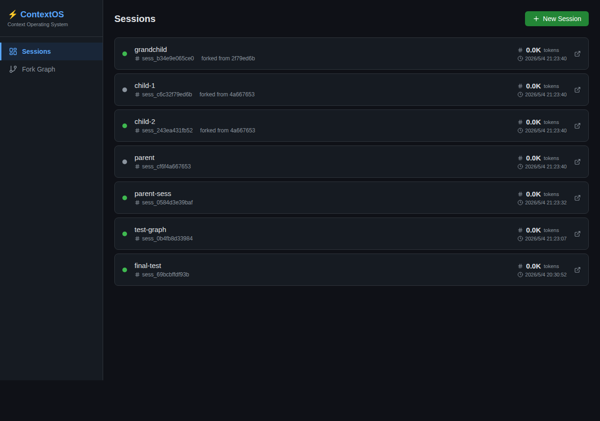
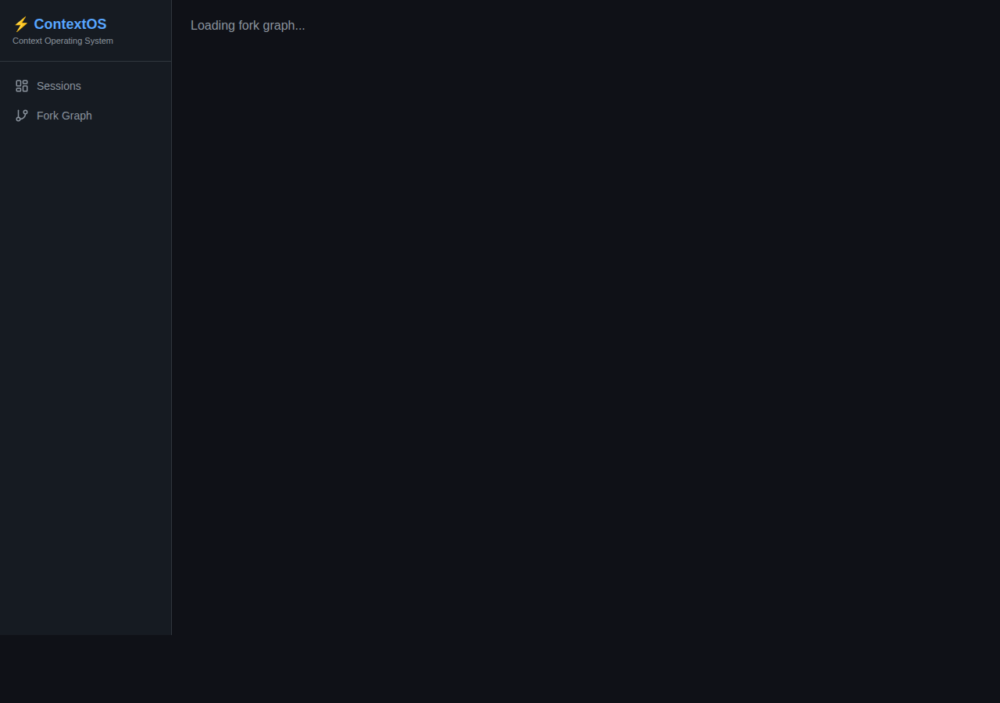

# ContextOS

[](https://www.python.org/)
[](LICENSE)
[](tests/)

**Claude Context Operating System** — A transparent proxy layer for the Claude API that provides Token observability, context control, session management, and session fork capabilities.

[中文文档](./README_zh.md)

---

## 🎯 Problem

Long-running Claude conversations suffer from:
- **Context explosion** — Token usage grows unbounded, hitting model limits
- **No visibility** — No built-in way to track token consumption per conversation
- **Lost history** — Starting fresh means losing valuable conversation context
- **Task interruption** — Long tasks break when context windows overflow

## ✨ Solution

ContextOS sits between you and the Claude API, providing:

| Feature | Benefit |
|---------|---------|
| **Token Observability** | Real-time prompt/completion breakdown with charts |
| **Session Management** | Persistent conversations with SQLite storage |
| **Session Fork** | Branch conversations with parent/child lineage tracking |
| **Context Engine** | Automatic message trimming, tool pruning, skill injection |
| **Web Dashboard** | React-based UI with React Flow graphs and Recharts visualizations |

---

## 📸 Screenshots

### Sessions Dashboard



### Fork Graph Visualization



*The fork graph shows session lineage with parent-child relationships, token counts at fork points, and interactive navigation.*

---

## 🚀 Quick Start

### Prerequisites

- Python 3.11+
- Node.js 18+ (optional, for frontend)
- [Anthropic API Key](https://console.anthropic.com/settings/keys)

### Installation

#### Option A: Virtual Environment (Recommended)

```bash
git clone https://github.com/CRF2004/ContextOS.git
cd ContextOS

python3 -m venv .venv
source .venv/bin/activate        # macOS/Linux
# .venv\Scripts\activate         # Windows

pip install -e ".[dev]"
ANTHROPIC_API_KEY=sk-ant-... contextos run --port 8199
```

#### Option B: pipx (Cleanest)

```bash
pipx install git+https://github.com/CRF2004/ContextOS.git
ANTHROPIC_API_KEY=sk-ant-... contextos run --port 8199
```

#### Option C: Without Installation

```bash
git clone https://github.com/CRF2004/ContextOS.git
cd ContextOS
pip install fastapi uvicorn httpx aiosqlite pydantic python-dotenv tiktoken
PYTHONPATH=src ANTHROPIC_API_KEY=sk-ant-... python -m contextos.cli run --port 8199
```

### Build Frontend (Optional)

```bash
cd web
npm install
npm run build    # outputs to ../dist/web
```

---

## 📖 Usage

### CLI Commands

```bash
# Start the proxy server
contextos run --port 8199 --db ./contextos.db

# List all sessions
contextos sessions

# View token usage for a session
contextos tokens sess_abc123

# View request logs
contextos logs sess_abc123
```

### API Examples

#### Create a Session

```bash
curl -X POST http://localhost:8199/api/sessions \
  -H "Content-Type: application/json" \
  -d '{"name": "my-conversation"}'
```

**Response:**
```json
{
  "session_id": "sess_a1b2c3d4e5f6",
  "name": "my-conversation",
  "status": "active",
  "parent_session_id": null,
  "total_tokens": 0,
  "created_at": "2026-05-04T12:00:00.000000+00:00"
}
```

#### Call Claude via Proxy

```bash
curl -X POST "http://localhost:8199/api/proxy/messages?session_id=sess_a1b2c3d4e5f6" \
  -H "Content-Type: application/json" \
  -d '{
    "model": "claude-sonnet-4-20250514",
    "messages": [{"role": "user", "content": "Hello!"}]
  }'
```

#### Fork a Session

```bash
curl -X POST http://localhost:8199/api/sessions/sess_a1b2c3d4e5f6/fork \
  -H "Content-Type: application/json" \
  -d '{
    "session_id": "sess_a1b2c3d4e5f6",
    "name": "my-conversation-branch",
    "carry_messages": 5
  }'
```

#### Get Fork Graph

```bash
curl http://localhost:8199/api/sessions/sess_a1b2c3d4e5f6/fork-graph
```

---

## 🏗 Architecture

```
                 ┌──────────────────────┐
                 │     Web Dashboard     │
                 │   (React + TypeScript)│
                 └─────────┬────────────┘
                           │
                 ┌─────────▼────────────┐
                 │   FastAPI Server     │
                 │     (Port 8199)      │
                 ├─────────┬────────────┤
                 │         │            │
     ┌───────────▼───┐ ┌──▼──────────┐ ┌▼─────────────┐
     │ Context Engine │ │ Fork Engine │ │ Token Profiler│
     └───────────┬───┘ └────┬────────┘ └────┬─────────┘
                 │           │               │
                 └────┬──────┴──────┬──────┘
                      │             │
            ┌─────────▼─────────────▼─────────┐
            │        Proxy Layer              │
            │   (Intercept → Profile → Log)   │
            └─────────┬───────────────────────┘
                      │
                 Claude API
```

### Core Modules

| Module | File | Responsibility |
|--------|------|----------------|
| **Proxy** | `proxy.py` | Intercept requests, forward to Claude, capture response |
| **Token Profiler** | `token_profiler.py` | Count tokens using tiktoken (Claude model support) |
| **Session Store** | `session_store.py` | SQLite persistence for sessions, tokens, logs |
| **Context Engine** | `context_engine.py` | Message trimming, tool pruning, skill injection |
| **Fork Engine** | `fork_engine.py` | Manual and auto-fork at token thresholds |

---

## 📡 API Reference

### Sessions

| Method | Endpoint | Description |
|--------|----------|-------------|
| `POST` | `/api/sessions` | Create session |
| `GET` | `/api/sessions` | List sessions |
| `GET` | `/api/sessions/{id}` | Get session |
| `POST` | `/api/sessions/{id}/archive` | Archive session |

### Tokens

| Method | Endpoint | Description |
|--------|----------|-------------|
| `GET` | `/api/sessions/{id}/tokens` | Token summary |
| `GET` | `/api/sessions/{id}/tokens/history` | Token history |
| `POST` | `/api/tokens/count` | Count text tokens |

### Forks

| Method | Endpoint | Description |
|--------|----------|-------------|
| `POST` | `/api/sessions/{id}/fork` | Fork session |
| `GET` | `/api/sessions/{id}/fork-graph` | Get fork graph |

### Proxy

| Method | Endpoint | Description |
|--------|----------|-------------|
| `POST` | `/api/proxy/messages?session_id=xxx` | Forward to Claude |

---

## 🧪 Testing

```bash
pip install pytest pytest-asyncio
PYTHONPATH=src python -m pytest tests/ -v
```

**26 tests** across 3 modules:
- `test_token_profiler.py` — Token counting accuracy
- `test_session_store.py` — CRUD operations, fork graphs
- `test_context_engine.py` — Trimming, pruning, injection

---

## 🗑 Uninstallation

### Virtual Environment
```bash
deactivate
rm -rf /path/to/ContextOS
```

### pipx
```bash
pipx uninstall contextos
```

### pip
```bash
pip uninstall contextos
rm -f ./contextos.db    # Optional: remove data
```

---

## 📄 License

MIT License — see [LICENSE](LICENSE) for details.
